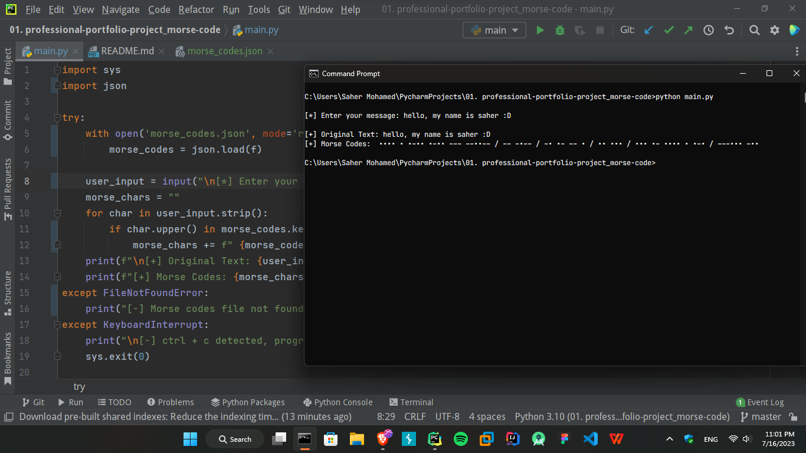

# Morse Code Converter
The Morse Code Converter is a Python script that converts text messages into Morse code. This script takes user input and converts each character into its corresponding Morse code representation. It provides a simple and interactive way to encode messages in Morse code.

## Usage
1. Make sure you have Python 3 installed on your system.
2. Clone or download this repository.
3. Open a terminal or command prompt and navigate to the project directory.
4. Run the script by executing the following command:
    ```commandline
    python main.py
    ```
5. Follow the on-screen instructions and enter your message when prompted.
6. The script will display the original text and its Morse code representation.

## Screenshot


## Morse Codes
The Morse code mappings are defined in the script using a dictionary. Each character is assigned its respective Morse code representation. The Morse code dictionary can be found in the script file.

## Author
This project is written by **Saher Muhamed** 16/7/2023.
